# Visual Guide

A visual walkthrough of the Contract Hierarchy System -- how data flows from
raw PDFs through ingestion, storage, materialization, and queries.

---

## 1. Ingestion Pipeline Flow

The complete journey of a PDF from upload to queryable state:

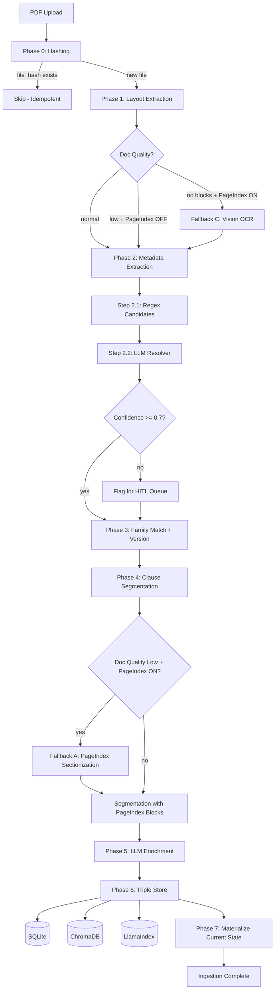

---

## 2. Data Model Relationships

How the four SQL tables relate to each other:

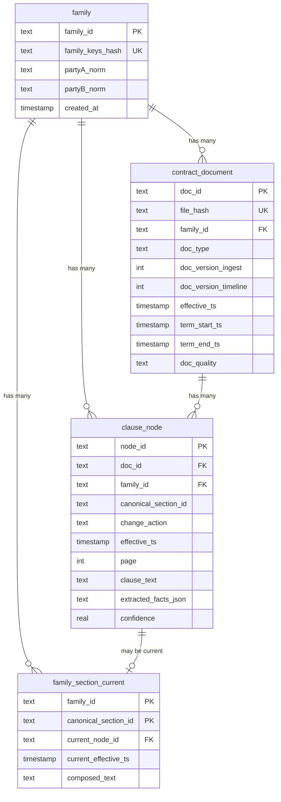

---

## 3. Family Matching + Versioning

How contracts are grouped and versioned:

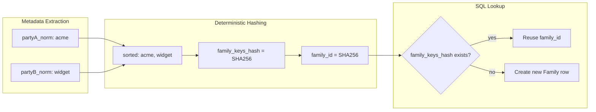

### Versioning with Out-of-Order Arrival

```
Ingestion Order        Timeline Order (by effective_ts)
===============        ================================
1. Amendment (Jun)     1. Master    (Jan)  <-- v_timeline=1
2. Master   (Jan)     2. Amendment (Jun)  <-- v_timeline=2

v_ingest:              v_timeline:
  Amendment = 1          Master    = 1
  Master    = 2          Amendment = 2
```

Both version numbers are stored. `doc_version_timeline` is recomputed across
the entire family on every ingestion, so out-of-order arrival is handled
correctly.

---

## 4. Canonical Section ID -- 3-Tier Strategy

How each clause chunk gets a stable identifier:

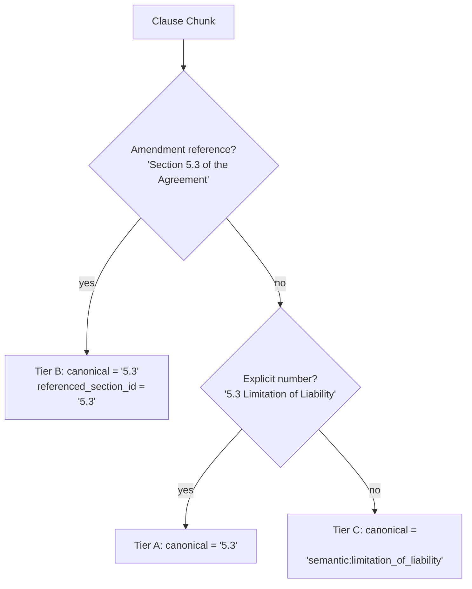

Tier B is checked first because it is more specific -- an amendment reference
like "Section 5.3 of the Agreement is hereby replaced" should be tagged as
Tier B, not Tier A.

---

## 5. Supersession Rules (Materialization)

How the current state is computed from a chain of clause nodes:

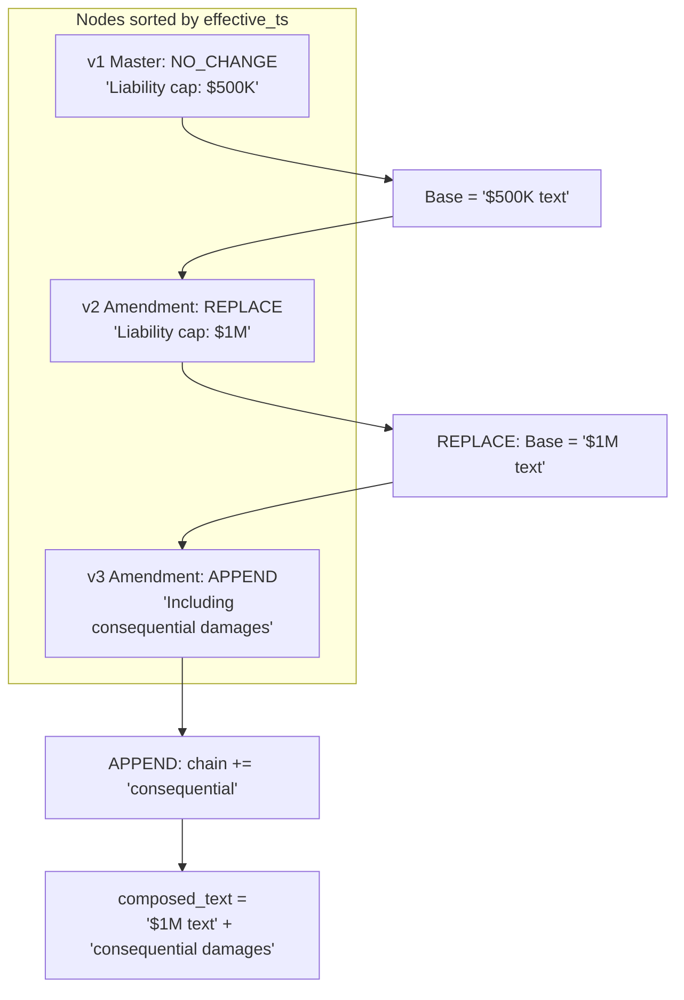

### Supersession Rule Summary

| Action | Effect |
|--------|--------|
| `REPLACE` | New text replaces all prior. Clears append chain. |
| `APPEND` | New text added to append chain after base. |
| `ADD_NEW` | Treated as new baseline (or REPLACE if section exists). |
| `DELETE` | Section marked as deleted. Clears everything. |
| `NO_CHANGE` | Sets baseline only if none exists yet. |
| Restatement (doc_type) | Full reset. Treated as new base document. |

---

## 6. Query Engine -- 4 Scenarios

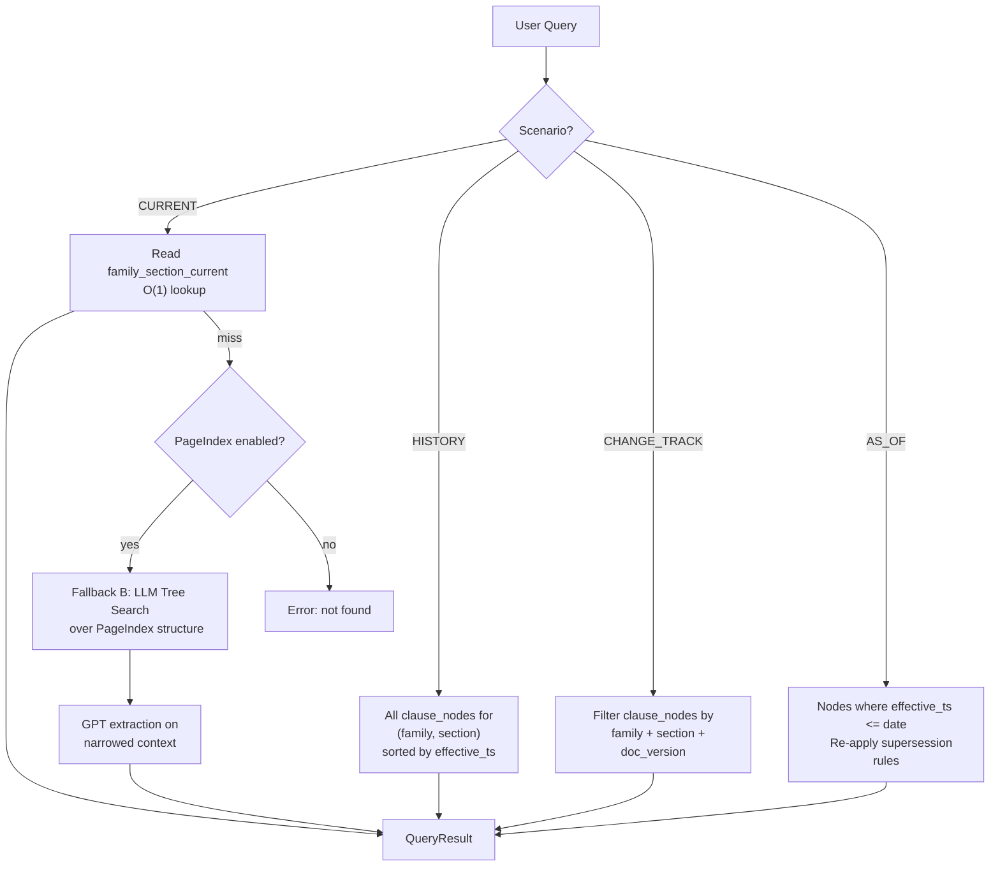

---

## 7. PageIndex Integration Points

Three fallback mechanisms using PageIndex's hierarchical tree structure:

```mermaid
flowchart TD
    subgraph fallbackA [Fallback A: Better Sectionization]
        A1["DocInt quality = 'low'"] --> A2["Run PageIndex
        page_index_main()"]
        A2 --> A3["Hierarchical TOC tree
        with page ranges"]
        A3 --> A4["Convert to LayoutBlocks"]
        A4 --> A5["Feed into clause pipeline"]
    end

    subgraph fallbackB [Fallback B: Retriever Fallback]
        B1["SQL query misses"] --> B2["Build/load PageIndex tree"]
        B2 --> B3["LLM tree search:
        'Which nodes contain
        limitation of liability?'"]
        B3 --> B4["GPT extraction on
        matched pages"]
        B4 --> B5["Return result"]
    end

    subgraph fallbackC [Fallback C: Vision OCR]
        C1["DocInt extraction fails
        or no blocks"] --> C2["Render pages as images
        via PyMuPDF"]
        C2 --> C3["Send to GPT-5-mini
        vision model"]
        C3 --> C4["Extract markdown text"]
        C4 --> C5["Convert to LayoutBlocks"]
        C5 --> C6["Feed into clause pipeline"]
    end
```

---

## 8. Triple Store Architecture

Data flows into three storage layers with different roles:

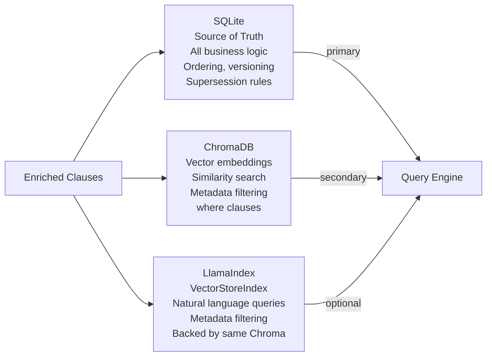

- **SQLite** is the single source of truth. All query scenarios run against SQL.
- **ChromaDB** stores embeddings for similarity-based retrieval with metadata filters.
- **LlamaIndex** wraps the same Chroma collection and adds query engine capabilities.
- If Chroma/LlamaIndex fail during ingestion, the pipeline continues (SQL is sufficient).

---

## 9. The 101st Contract

When a new contract arrives, the exact same pipeline runs:

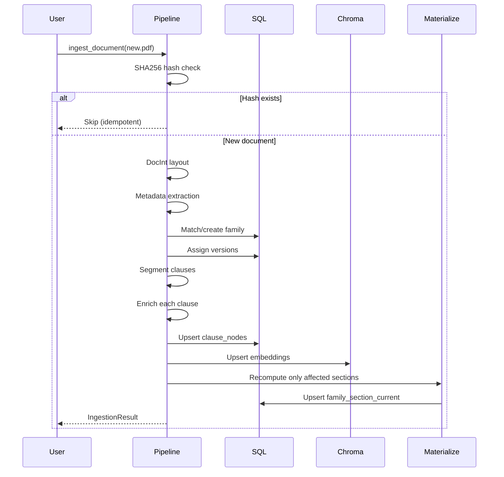

---

## 10. CLI Command Map

```
cli.py
  |
  +-- init-db              Create all SQL tables
  |
  +-- ingest
  |     +-- --pdf FILE      Single PDF ingestion
  |     +-- --dir DIR        Batch ingest directory
  |     +-- --force          Re-process even if exists
  |
  +-- query
  |     +-- current          Scenario 1: Current clause text
  |     +-- history          Scenario 2: Change timeline
  |     +-- changes          Scenario 3: Version diff
  |     +-- as-of            Scenario 4: State at past date
  |     +-- search           PageIndex tree-search fallback
  |
  +-- materialize            Recompute family current state
```

---

## 11. Module Dependency Graph

```mermaid
flowchart TD
    cli[cli.py] --> pipeline[ingestion/pipeline.py]
    cli --> engine[query/engine.py]
    cli --> materialize[materialization/current_state.py]
    cli --> migrations[db/migrations.py]

    pipeline --> layout[ingestion/layout.py]
    pipeline --> metadata[ingestion/metadata.py]
    pipeline --> family[ingestion/family.py]
    pipeline --> clause[ingestion/clause.py]
    pipeline --> enrichment[ingestion/enrichment.py]
    pipeline --> store[ingestion/store.py]
    pipeline --> materialize
    pipeline --> pageindex[integrations/pageindex_stub.py]

    layout --> docint[integrations/azure_docint.py]
    metadata --> openai[integrations/openai_client.py]
    metadata --> normalization[utils/normalization.py]
    metadata --> validation[utils/validation.py]
    enrichment --> openai
    enrichment --> validation
    store --> chroma[integrations/chroma_store.py]
    store --> llamaindex[integrations/llamaindex_store.py]
    store --> openai

    engine --> materialize
    engine --> pageindex
    engine --> openai
    pageindex --> openai
    pageindex --> docint

    docint --> config[config.py]
    openai --> config
    chroma --> config
    llamaindex --> config
    pageindex --> config

    family --> hashing[ingestion/hashing.py]
    store --> hashing
    engine --> hashing

    layout --> models[db/models.py]
    family --> models
    store --> models
    materialize --> models
    engine --> models
    migrations --> models

    migrations --> session[db/session.py]
    session --> config
```

---

## 12. Master End-to-End Diagram

The complete system in one diagram -- ingestion, materialization, queries, and
all three PageIndex fallbacks:

```mermaid
flowchart TB
  subgraph Entry["Entry Points"]
    U1["Batch Upload - N PDFs"] --> Q0["Queue / Orchestrator"]
    U2["Single Upload - 101st Contract"] --> Q0
  end

  subgraph P0["Phase 0: Idempotency"]
    Q0 --> H0["Compute file_hash = SHA256 of pdf_bytes"]
    H0 --> Exists{file_hash exists in SQL?}
    Exists -->|Yes| Skip["Skip - Idempotent"]
    Exists -->|No| P1A
  end

  subgraph P1["Phase 1: Layout Extraction + Guardrail"]
    P1A["Azure DocInt: prebuilt-layout"] --> L0["Layout JSON to LayoutBlocks"]
    L0 --> Usable{"are_blocks_usable?"}
    Usable -->|Yes| BlocksOK["Blocks OK"]
    Usable -->|No| Clear["Clear blocks, set doc_quality=low"]
    Clear --> BlocksLow["Blocks empty or low-quality"]
  end

  subgraph FC["Fallback C: Vision OCR"]
    BlocksLow --> VQ{PageIndex Vision OCR enabled?}
    VQ -->|Yes| V1["Render pages as images via PyMuPDF"]
    V1 --> V2["GPT-5-mini vision to markdown"]
    V2 --> V3["Convert markdown to LayoutBlocks"]
    V3 --> BlocksOK2["Recovered Blocks OK"]
    VQ -->|No| BlocksOK3["Proceed with empty blocks"]
  end

  subgraph P2["Phase 2: Document Metadata"]
    BlocksOK --> Cand["2.1 Extract candidates via regex"]
    BlocksOK2 --> Cand
    BlocksOK3 --> Cand
    Cand --> Resolve["2.2 GPT Resolver: effective_ts, parties, term"]
    Resolve --> Conf{confidence >= threshold?}
    Conf -->|Yes| MetaOK["Metadata OK"]
    Conf -->|No| HITL["Flag HITL but continue"]
    HITL --> MetaOK
  end

  subgraph P3["Phase 3: Family Match + Versioning"]
    MetaOK --> Keys["family_keys_hash = SHA256 of sorted parties"]
    Keys --> Fam{family_keys_hash exists?}
    Fam -->|Yes| Reuse["Reuse family_id"]
    Fam -->|No| Create["Create new family row"]
    Reuse --> Ver["Assign doc_version_ingest - append counter"]
    Create --> Ver
    Ver --> Recompute["Recompute doc_version_timeline by effective_ts"]
  end

  subgraph P4["Phase 4: Clause Segmentation"]
    Recompute --> Qual{doc_quality=low AND PageIndex ON?}
    Qual -->|Yes| FallbackA["Fallback A: PageIndex TOC tree"]
    Qual -->|No| SegA["Segment using DocInt headings"]
    FallbackA --> SegB["Segment clauses from blocks"]
    SegA --> SegB
    SegB --> Canon["Canonical Section ID: Tier B then A then C"]
  end

  subgraph P5["Phase 5: Clause Enrichment"]
    Canon --> Enrich["GPT Enrichment per clause"]
    Enrich --> Val{JSON valid + confidence OK?}
    Val -->|Yes| ClauseOK["Clause metadata OK"]
    Val -->|No| Retry["Retry with more context"]
    Retry --> Val2{valid now?}
    Val2 -->|Yes| ClauseOK
    Val2 -->|No| FlagLow["Store but mark low_confidence"]
    FlagLow --> ClauseOK
  end

  subgraph P6["Phase 6: Triple Store"]
    ClauseOK --> SQL1["Upsert SQL: contract_document + clause_node"]
    SQL1 --> Emb["Embed clause_text"]
    Emb --> Chroma["Try Chroma upsert - non-blocking"]
    Chroma --> LIdx["Try LlamaIndex upsert - non-blocking"]
  end

  subgraph P7["Phase 7: Materialize Current State"]
    SQL1 --> Mat["Recompute impacted family_id + section_id pairs"]
    Mat --> Curr["Upsert family_section_current"]
    Curr --> Done["Ingestion Complete"]
  end

  subgraph QRY["Query Engine + PageIndex Retriever Fallback"]
    Ask["User Query"] --> Router{Scenario Router}
    Router -->|CURRENT| QC["SQL: read family_section_current"]
    Router -->|HISTORY| QH["SQL: all clause_nodes sorted by effective_ts"]
    Router -->|CHANGE_TRACK| QCT["SQL: filter by doc_version + section"]
    Router -->|AS_OF| QAO["SQL: effective_ts <= date, reapply supersession"]

    QC --> Miss{miss?}
    Miss -->|No| Ans["Final Answer"]
    Miss -->|Yes| FB{PageIndex retriever ON?}
    FB -->|Yes| FallbackB["Fallback B: PageIndex tree search"]
    FallbackB --> Extract["GPT extract on narrowed context"]
    Extract --> Ans
    FB -->|No| NotFound["Not found"]

    QH --> Ans
    QCT --> Ans
    QAO --> Ans
  end

  Done --> Ask
```

---

## 13. Stakeholder Swimlane Diagram

Who does what -- showing the responsibility boundaries between the user, the
orchestrator, each external service, and the storage layers:

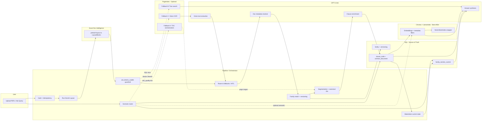
